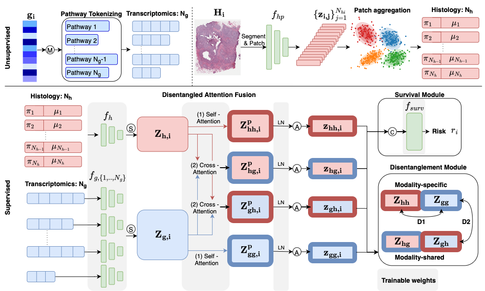

# Disentangled and Interpretable Multimodal Attention Fusion for Cancer Survival Prediction

To improve the prediction of cancer survival using whole-slide images and transcriptomics data, it is crucial to capture both modality-shared and modality-specific information. However, multimodal frameworks often entangle these representations, limiting interpretability and potentially suppressing discriminative features.  To address this, we propose **Disentangled and Interpretable Multimodal Attention Fusion (DIMAF)**, a multimodal framework that separates the intra- and inter-modal interactions within an attention-based fusion mechanism to learn distinct modality-specific and modality-shared representations. We introduce a loss based on Distance Correlation to promote disentanglement between these representations and integrate Shapley Additive ExPlanations (SHAP) to assess their relative contributions to survival prediction. We evaluate DIMAF on four public cancer survival datasets, achieving a relative average improvement of 1.85% in performance and 23.7% in disentanglement compared to current state-of-the-art multimodal models. Beyond improved performance, our interpretable framework enables a deeper exploration of the underlying interactions between and within modalities in cancer biology. 



**Contact:** Aniek Eijpe (a.eijpe@uu.nl)

## Updates
- **16-09-2025:** First version of the codebase is online!
- **TODO:** Update references, paper is accepted at MICCAI 2025.

## Future work
As stated in the paper, future work is currently exploring the inherent interpretability of DIMAF by combining the attention weights of the intra- and inter-modal interactions with SHAP values of the multimodal disentangled features to capture both modality-shared and modality-specific feature importance and multimodal interactions. This dual approach will offer more robust insights into how different data modalities interact in DIMAF for accurate survival prediction. 
**Coming soon – stay tuned!**

## Model checkpoints
Our model is trained on the outputs of the [UNI](https://github.com/mahmoodlab/UNI) foundation model. Due to [UNI licensing restrictions](https://huggingface.co/MahmoodLab/UNI), we cannot provide the pretrained weights of our model directly.
Instead, we provide detailed instructions to fully reproduce our results. If anything is unclear or if you encounter issues, please don’t hesitate to open an issue or contact us via email at a.eijpe@uu.nl.

## Usage
### Installation
After cloning the repository, create the DIMAF conda environment as follows:
```
cd DIMAF
conda env create -f env.yml
conda activate dimaf
```

### Running DIMAF
The full workflow consists of the following steps:
- Data preprocessing
- Constructing initial histology prototypes
- Training and testing DIMAF for survival prediction
- Running SHAP asses the importance of the disentangled representations
- Visualization and further interpretability of DIMAF

For detailed instructions on each step, please see the [README](src/README.md) in the `src` folder.


## Acknowledgements
This project builds upon several excellent research repositories, including [MMP](https://github.com/mahmoodlab/MMP), [UNI](https://github.com/mahmoodlab/UNI), [CLAM](https://github.com/mahmoodlab/CLAM) and [CSDisentanglement_Metrics_Library](https://github.com/vios-s/CSDisentanglement_Metrics_Library).
We are grateful to the authors and developers of these projects for their contributions and for sharing their work openly.

## Reference
Please consider citing our [paper](https://arxiv.org/abs/2503.16069) if this work or code contributes to your research.
```
@article{eijpe2025disentangled,
    title={Disentangled and Interpretable Multimodal Attention Fusion for cancer survival prediction},
    author={Eijpe, Aniek and Lakbir, Soufyan and Cesur, Melis Erdal and Oliveira, Sara P and Abeln, Sanne and Silva, Wilson},
    journal={arXiv preprint arXiv:2503.16069},
    year={2025}
    }
```


